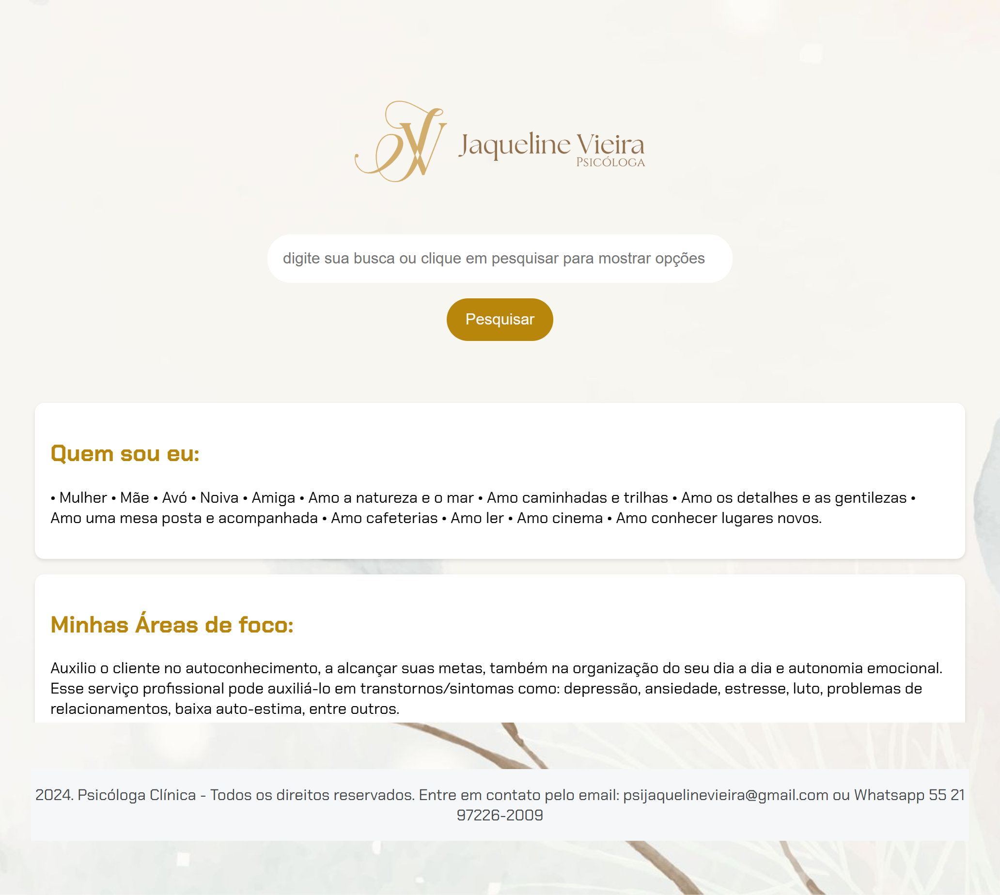

# 💼 Psicóloga Jaqueline Vieira – Site Institucional

Este projeto foi desenvolvido com base em uma **imersão da Alura**, focada na criação de páginas modernas com HTML, CSS e Bootstrap. A proposta foi adaptada para representar um **site institucional profissional para a psicóloga Jaqueline Vieira**, com informações sobre seus serviços, áreas de atuação e formas de contato.

🔗 **Site publicado:**  
[https://psijaquelinevieira.netlify.app](https://psijaquelinevieira.netlify.app)

---

## ✨ Funcionalidades

- Página institucional responsiva
- Apresentação de especialidades psicológicas
- Estilo adaptado com cores suaves e acolhedoras
- Rodapé com política de privacidade
- Link para contato direto
- Layout baseado no Bootstrap 5

---

## 🛠️ Tecnologias Utilizadas

- HTML5
- CSS3
- Bootstrap 5.3
- Netlify (deploy)

---

## 📸 Captura de Tela

<!-- Se você tiver uma imagem no repositório, substitua abaixo -->


---

## 🎓 Base de Aprendizado

Este projeto foi inspirado em uma **imersão da Alura**, onde aprendi:

- Como estruturar uma landing page com Bootstrap
- Organização de seções com containers, rows e colunas
- Responsividade com classes utilitárias
- Aplicação de boas práticas visuais (hierarquia, contraste, espaçamento)
- Publicação do site com o Netlify

---

## 🚀 Como executar localmente

1. Clone o repositório:
```bash
git clone https://github.com/juulianuness/Psicologa-Jaqueline-Vieira.git
